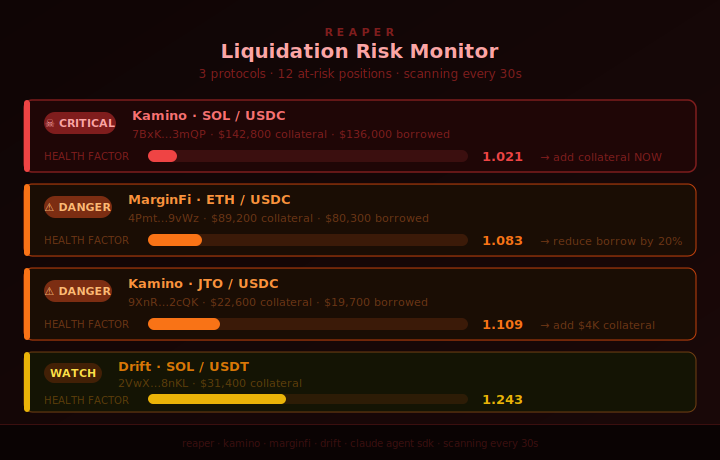
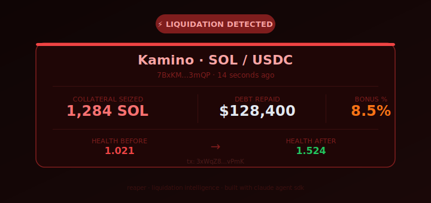

<div align="center">

# Reaper

**Solana distressed-collateral hunter.**
Scores liquidation edge, oracle drift, keeper-race probability, and unwind quality before calling a setup actionable.

[](https://github.com/ReaperProtocol/Reaper/actions)

[](https://docs.anthropic.com/en/docs/agents-and-tools/claude-agent-sdk)
[](https://www.typescriptlang.org/)

</div>

---

Liquidation tooling is usually owner-centric. Reaper is built from the other side of the trade. It looks for distressed accounts where the liquidation edge still survives stale oracles, slot congestion, and unwind friction.

`Reaper` scans lending books, enriches each distressed account with oracle-age, mark-drift, keeper-race, and unwind-quality fields, then asks a Claude agent to decide whether the account is merely dangerous or actually worth pursuing.
The emphasis is on whether the edge survives execution friction, not just whether the health factor looks ugly.

`SCAN -> PRICE EDGE -> CHECK ORACLE -> MODEL KEEPER RACE -> HUNT`

---

## Distressed Flow Console



---

## Liquidation Ticket



---

## Technical Spec

Reaper estimates liquidation opportunity quality with:

`Edge = grossLiquidationSpread - slippageCost - priorityFee - keeperFailurePenalty - oraclePenalty`

Additional guards:

- reject marginal setups when `oracleAgeSeconds > MAX_ORACLE_AGE_SECONDS`
- reject when `oracleDriftBps > ORACLE_DRIFT_THRESHOLD_BPS`
- rank by `liquidationEdgeUsd * keeperRaceProbability`
- surface `unwindQuality` so distressed collateral that cannot be exited cleanly is demoted

The repo deliberately distinguishes between:

- a position that is close to liquidation
- a position that is actually worth chasing

Those are not the same.

---

## Quick Start

```bash
git clone https://github.com/ReaperProtocol/Reaper
cd Reaper && bun install
cp .env.example .env
bun run dev
```

---

## Configuration

```bash
ANTHROPIC_API_KEY=sk-ant-...
HELIUS_API_KEY=...
HEALTH_WARN_THRESHOLD=1.15
HEALTH_DANGER_THRESHOLD=1.05
ORACLE_DRIFT_THRESHOLD_BPS=45
MAX_ORACLE_AGE_SECONDS=75
MIN_LIQUIDATION_EDGE_USD=40
```

---

## Legitimacy Notes

- Planned commit sequence: [`docs/commit-sequence.md`](docs/commit-sequence.md)
- Draft engineering issues: [`docs/issue-drafts.md`](docs/issue-drafts.md)

---

## License

MIT

---

*hunt the edge, not just the health factor.*
