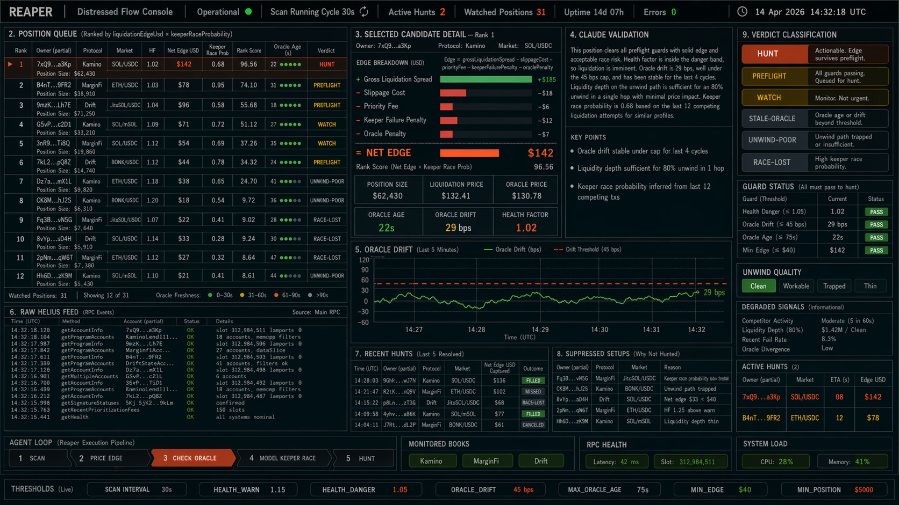
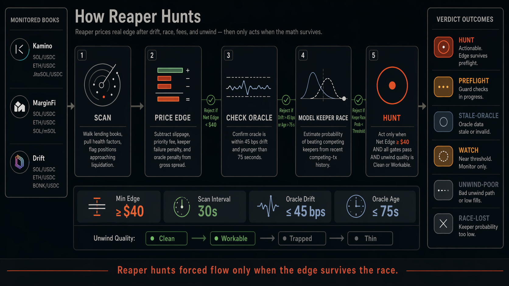

<div align="center">

# Reaper

**Solana distressed-collateral hunter.**
Scores liquidation edge, oracle drift, keeper-race probability, and unwind quality before calling a setup actionable.

[](https://github.com/ReaperProtocol/Reaper/actions)

[](https://docs.anthropic.com/en/docs/agents-and-tools/claude-agent-sdk)
[](https://www.typescriptlang.org/)

</div>

---

Liquidation tooling is usually owner-centric. Reaper is built from the other side of the trade. It looks for distressed accounts where the liquidation edge still survives stale oracles, slot congestion, and unwind friction.

`Reaper` scans lending books, enriches each distressed account with oracle-age, mark-drift, keeper-race, and unwind-quality fields, then asks a Claude agent to decide whether the account is merely dangerous or actually worth pursuing.
The emphasis is on whether the edge survives execution friction, not just whether the health factor looks ugly.

`SCAN -> PRICE EDGE -> CHECK ORACLE -> MODEL KEEPER RACE -> HUNT`

---

Live Distressed Flow Console • How Reaper Hunts • At a Glance • Operating Surfaces • How It Works • Example Output • Technical Spec • Risk Controls • Quick Start

## At a Glance

- `Use case`: identify distressed Solana lending accounts that are actually worth chasing
- `Primary input`: liquidation spread, oracle freshness, keeper-race probability, unwind quality
- `Primary failure mode`: mistaking visible danger for profitable liquidation edge
- `Best for`: operators who care about execution-quality edge, not just liquidation proximity

## Live Distressed Flow Console



Live operating view for Reaper: position queue across monitored books, selected candidate detail with edge math, oracle drift chart, raw feed, suppressed items, guard status, active hunts, and the agent's current HUNT, PREFLIGHT, WATCH, STALE-ORACLE, UNWIND-POOR, or RACE-LOST decision.

## How Reaper Hunts



How Reaper hunts forced flow: scan monitored books, price the edge after fees and penalties, reject stale oracle setups, model keeper-race probability, and act only when edge, gates, and unwind quality all survive.

## Operating Surfaces

- `Distressed Flow Console`: ranks accounts by edge quality, not just risk level
- `How Reaper Hunts`: explains how edge survives fees, oracle checks, keeper race, and unwind quality before a hunt is actionable
- `Oracle Drift Check`: rejects setups where stale pricing invalidates the apparent edge
- `Keeper Race Model`: estimates whether the liquidation can still be won after congestion and fees

## Why Reaper Exists

Many liquidation boards tell you which positions are unsafe. That is useful, but it is not the same as telling you which positions are actually worth pursuing.

Reaper exists to bridge that gap. A distressed account can look attractive and still be untradeable once stale oracles, slot congestion, priority fees, and unwind friction are all counted honestly.

## How It Works

Reaper follows a liquidation-quality loop:

1. scan the monitored books for distressed accounts
2. estimate the gross liquidation spread
3. discount that spread for oracle age, mark drift, keeper competition, and unwind friction
4. rank the remaining accounts by edge that still survives execution
5. emit a ticket only when the opportunity is dangerous and actionable

The goal is not to find every risky account. The goal is to find the ones where the edge is still real.

## What A Real Reaper Setup Looks Like

- the liquidation spread is still positive after friction
- oracle age and drift are still inside acceptable bounds
- keeper race probability is strong enough to justify the attempt
- seized collateral still looks exit-able after the liquidation

If those pieces do not line up, the account may be distressed but not worth the chase.

## Example Output

```text
REAPER // LIQUIDATION TICKET

market             SOL/USDC
health factor      1.021
net edge           $142
oracle age         32s
keeper race        0.62
unwind quality     0.78

operator note: edge still survives fees and oracle guardrails
```

## Technical Spec

Reaper estimates liquidation opportunity quality with:

`Edge = grossLiquidationSpread - slippageCost - priorityFee - keeperFailurePenalty - oraclePenalty`

Additional guards:

- reject marginal setups when `oracleAgeSeconds > MAX_ORACLE_AGE_SECONDS`
- reject when `oracleDriftBps > ORACLE_DRIFT_THRESHOLD_BPS`
- rank by `liquidationEdgeUsd * keeperRaceProbability`
- surface `unwindQuality` so distressed collateral that cannot be exited cleanly is demoted

The repo deliberately distinguishes between:

- a position that is close to liquidation
- a position that is actually worth chasing

Those are not the same.

## Risk Controls

- `oracle freshness gate`: rejects setups where pricing is too stale to trust
- `drift threshold`: blocks liquidations that look profitable only because the oracle is off
- `keeper race filter`: downgrades opportunities that are unlikely to be won
- `unwind quality check`: rejects collateral that still looks too hard to exit after seizure

Reaper is strict because an ugly health factor does not pay you by itself.

## Quick Start

```bash
git clone https://github.com/ReaperProtocol/Reaper
cd Reaper && bun install
cp .env.example .env
bun run dev
```

## Configuration

```bash
ANTHROPIC_API_KEY=sk-ant-...
HELIUS_API_KEY=...
HEALTH_WARN_THRESHOLD=1.15
HEALTH_DANGER_THRESHOLD=1.05
ORACLE_DRIFT_THRESHOLD_BPS=45
MAX_ORACLE_AGE_SECONDS=75
MIN_LIQUIDATION_EDGE_USD=40
```

## Legitimacy Notes

- Planned commit sequence: [`docs/commit-sequence.md`](docs/commit-sequence.md)
- Draft engineering issues: [`docs/issue-drafts.md`](docs/issue-drafts.md)

## Support Docs

- [Runbook](docs/runbook.md)
- [Changelog](CHANGELOG.md)
- [Contributing](CONTRIBUTING.md)
- [Security](SECURITY.md)

## License

MIT

---

*hunt the edge, not just the health factor.*
